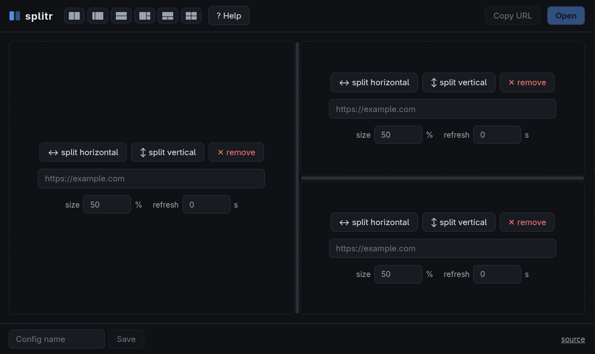

# [splitr](https://manutopik.github.io/splitr/)

**Split-screen iframe viewer** — display several web pages in one screen, with the whole layout encoded in the URL. Any combination is shareable as a single link.

[](https://github.com/ManUtopiK/splitr/actions/workflows/deploy.yml)
[](https://github.com/ManUtopiK/splitr/actions/workflows/release.yml)
[](https://github.com/ManUtopiK/splitr/releases)
[](https://opensource.org/licenses/MIT)

**▶ Try it live: [manutopik.github.io/splitr](https://manutopik.github.io/splitr/)**



## Features

- **Layout in the URL** — every split, size and option is encoded in the link; share a full dashboard as one URL
- **Nested splits** — divide panels horizontally or vertically, as deep as you want (inspired by [frame-splits](https://github.com/dsingleton/frame-splits))
- **Visual editor** — fill a URL per panel, pick a layout preset, adjust per-panel size (%), then *Copy URL* or *Open*
- **Per-panel auto-refresh** — reload any panel on its own interval (seconds)
- **Resizable viewer** — drag the dividers; sizes are remembered per URL in localStorage
- **Saved configurations** — name and store layouts locally (localStorage)
- **Viewer menu** — discreet corner button: edit layout, copy URL, fullscreen, reset sizes
- **Custom page title** — `?t=` sets the tab title (defaults to the embedded hosts)
- **Single-file build** — one self-contained `index.html` (JS + CSS inlined): serve it with Caddy, nginx, GitHub Pages or open it from disk

## Usage

```
https://splitr.example.com/?a=https://first.example&b=https://second.example
```

| Param   | Description                                                        |
| ------- | ------------------------------------------------------------------ |
| `a`,`b` | The two page URLs (simple side-by-side layout)                     |
| `dir`   | `h` side by side (default) or `v` stacked                          |
| `ratio` | Percentage of the space given to the first panel (default `50`)    |
| `l`     | Full layout tree (base64url JSON) — nested splits, refresh options |
| `t`     | Optional page title (defaults to the embedded hosts)               |
| `edit`  | Open the configuration editor pre-filled with the layout           |

Without parameters, the **editor** opens: fill a URL per panel, split panels horizontally/vertically (layouts nest freely, inspired by [frame-splits](https://github.com/dsingleton/frame-splits)), set per-panel size (%) and optional auto-refresh (seconds), then *Copy URL* or *Open*. Named configurations can be saved locally (localStorage).

In the **viewer**, drag the dividers to resize — sizes are remembered per URL in localStorage. The discreet top-left corner button opens a menu: edit layout, copy URL, fullscreen, reset sizes.

> Note: a site only renders inside an iframe if it allows it. Sites sending restrictive `X-Frame-Options` / CSP `frame-ancestors` headers (Google, GitHub…) will stay blank.

## Self-hosting

The build is a single `index.html` — grab it from the [latest release](https://github.com/ManUtopiK/splitr/releases/latest) (or `npm run build`) and serve it with any static server.

**Caddy**

```caddy
splitr.example.com {
	root * /srv/splitr
	file_server
}
```

**nginx**

```nginx
server {
	listen 80;
	server_name splitr.example.com;
	root /srv/splitr;

	location / {
		try_files /index.html =404;
	}
}
```

## Development

```bash
npm install
npm run dev      # dev server
npm run test     # vitest unit tests (URL codec, layout tree)
npm run check    # vue-tsc typecheck
npm run build    # dist/index.html (single file)
```

Stack: Vue 3 + [rolldown-vite](https://vitejs.dev/guide/rolldown) (oxc) + [vite-plugin-singlefile](https://github.com/richardtallent/vite-plugin-singlefile).

## Nix

```bash
nix build .#splitr   # result/index.html
nix develop          # node + prefetch-npm-deps
```

After changing `package-lock.json`, refresh the hash in `flake.nix`:

```bash
prefetch-npm-deps package-lock.json
```

## License

MIT
