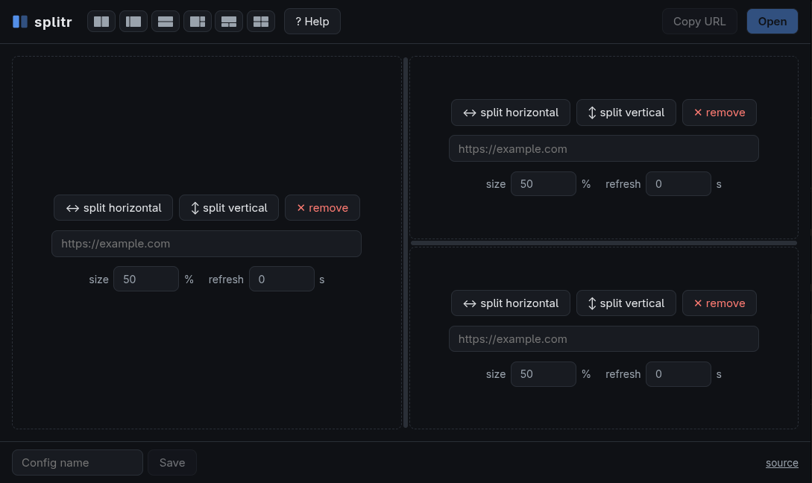

# [splitr](https://manutopik.github.io/splitr/)

**Split-screen iframe viewer** — display several web pages in one screen, with the whole layout encoded in the URL. Any combination is shareable as a single link.

[](https://github.com/ManUtopiK/splitr/actions/workflows/deploy.yml)
[](https://github.com/ManUtopiK/splitr/actions/workflows/release.yml)
[](https://github.com/ManUtopiK/splitr/releases)
[](https://opensource.org/licenses/MIT)

**▶ Try it live: [manutopik.github.io/splitr](https://manutopik.github.io/splitr/)**



## Features

- **Layout in the URL** — every split, size and option is encoded in the link; share a full dashboard as one URL
- **Nested splits** — divide panels horizontally or vertically, as deep as you want (inspired by [frame-splits](https://github.com/dsingleton/frame-splits))
- **Visual editor** — fill a URL per panel, pick a layout preset, adjust per-panel size (%), then *Copy URL* or *Open*
- **Per-panel auto-refresh** — reload any panel on its own interval (seconds)
- **Resizable viewer** — drag the dividers; sizes are remembered per URL in localStorage
- **Tab sync** — optional: mirror resizes live across all your tabs showing the same layout (BroadcastChannel, opt-in from the viewer menu)
- **Presenter sessions** — share a live link: one presenter drives the layout, panel URLs and sizes for everyone, with a shared pointer (peer-to-peer over WebRTC, no account)
- **Saved configurations** — name and store layouts locally (localStorage)
- **Viewer menu** — discreet corner button: edit layout, copy URL, fullscreen, reset sizes
- **Custom page title** — `?t=` sets the tab title (defaults to the embedded hosts)
- **Single-file build** — one self-contained `index.html` (JS + CSS inlined): serve it with Caddy, nginx, GitHub Pages or open it from disk

## Usage

```
https://splitr.example.com/?a=https://first.example&b=https://second.example
```

| Param   | Description                                                        |
| ------- | ------------------------------------------------------------------ |
| `a`,`b` | The two page URLs (simple side-by-side layout)                     |
| `dir`   | `h` side by side (default) or `v` stacked                          |
| `ratio` | Percentage of the space given to the first panel (default `50`)    |
| `l`     | Full layout tree (base64url JSON) — nested splits, refresh options |
| `t`     | Optional page title (defaults to the embedded hosts)               |
| `edit`  | Open the configuration editor pre-filled with the layout           |
| `room`  | Join a live presenter session (see below)                          |
| `signal`| Override WebRTC signaling servers (comma-separated, session only)   |
| `stun`  | Override STUN servers (comma-separated, session only)              |

Without parameters, the **editor** opens: fill a URL per panel, split panels horizontally/vertically (layouts nest freely, inspired by [frame-splits](https://github.com/dsingleton/frame-splits)), set per-panel size (%) and optional auto-refresh (seconds), then *Copy URL* or *Open*. Named configurations can be saved locally (localStorage).

In the **viewer**, drag the dividers to resize — sizes are remembered per URL in localStorage. The discreet top-left corner button opens a menu: edit layout, copy URL, fullscreen, reset sizes.

## Presenter mode

Turn any layout into a **live session** where one presenter drives the view for everyone — useful for walkthroughs, dashboards on a wall of screens, or remote demos.

Start one from the editor's **Present** menu (or the viewer's **Start session**). You become the *presenter* and your URL is just `…?room=<id>` — **no secret in the address bar**, so it's safe to screen-share. Your presenter key is kept in this browser's `localStorage`, never in the URL. Two links from the session menu:

- **Spectator link** — `…?room=<id>` — share it; recipients watch, read-only.
- **Co-presenter link** — `…?room=<id>#key=<secret>` — share it only with someone you want to *co-drive* the session. Opening it grants presenter control, then the key is stored locally and stripped from their address bar.

The presenter controls, propagated live to every spectator:

- **layout & sizes** — splits and divider drags apply immediately for everyone;
- **panel URLs** — hover a panel to reveal an inline URL bar and retarget a single iframe. Spectators are **not** reloaded: a *“Le présentateur affiche …”* banner appears over that panel only, and each spectator clicks **Basculer** to switch (or **Ignorer**). Other panels are untouched;
- **shared pointer** — toggle **Mode pointeur** to broadcast the presenter's cursor over all panels (an overlay captures the pointer above iframes, so clicking through is paused while it's on);
- **scheduled start** *(optional)* — set a start date/time; until then spectators see a countdown instead of the panels (based on each viewer's own clock);
- **require a name** *(optional)* — spectators must enter a name before the panels appear, so the presenter sees who's connected.

How it works: state is shared peer-to-peer through a [Yjs](https://yjs.dev) document over [y-webrtc](https://github.com/yjs/y-webrtc) — no server stores anything, no account. The presenter role is whoever holds the key in `localStorage` for that room (the session creator, or anyone who opened a co-presenter link). The role is tied to the browser, so switching device or clearing storage drops it.

> **Known limitations.** The role is cooperative, not cryptographically enforced (fine for trusted groups). Sessions use a public best-effort signaling server (`wss://signaling.yjs.dev`) and a public STUN server; override them with `?signal=` / `?stun=`. There is no TURN relay, so peers behind a symmetric NAT or strict corporate firewall may fail to connect. The shared pointer is positioned as a fraction of each panel, so it stays in the right panel for everyone, but it cannot land on the exact same pixel of an embedded page across differently-sized windows — the iframe content is cross-origin and doesn't scale with the panel. For pixel-accurate pointing, viewers should use similar window sizes. When the presenter navigates *inside* a cross-origin panel (clicking a link in the embedded site), that navigation can't be detected or replayed — the browser hides a third-party iframe's URL. Use the per-panel URL bar to push a new address explicitly instead.

> Note: a site only renders inside an iframe if it allows it. Sites sending restrictive `X-Frame-Options` / CSP `frame-ancestors` headers (Google, GitHub…) will stay blank. Some apps also break when your browser **blocks third-party storage/cookies**: embedded cross-site, their unguarded `localStorage` access throws and the app fails to start (blank). Allow third-party cookies for the page, or the embedded site needs to handle the denial.

## Self-hosting

The build is a single `index.html` — grab it from the [latest release](https://github.com/ManUtopiK/splitr/releases/latest) (or `npm run build`) and serve it with any static server.

**Caddy**

```caddy
splitr.example.com {
	root * /srv/splitr
	file_server
}
```

**nginx**

```nginx
server {
	listen 80;
	server_name splitr.example.com;
	root /srv/splitr;

	location / {
		try_files /index.html =404;
	}
}
```

## Development

```bash
npm install
npm run dev      # dev server
npm run test     # vitest unit tests (URL codec, layout tree)
npm run check    # vue-tsc typecheck
npm run build    # dist/index.html (single file)
```

Stack: Vue 3 + [rolldown-vite](https://vitejs.dev/guide/rolldown) (oxc) + [vite-plugin-singlefile](https://github.com/richardtallent/vite-plugin-singlefile).

## Nix

```bash
nix build .#splitr   # result/index.html
nix develop          # node + prefetch-npm-deps
```

After changing `package-lock.json`, refresh the hash in `flake.nix`:

```bash
prefetch-npm-deps package-lock.json
```

## License

MIT
